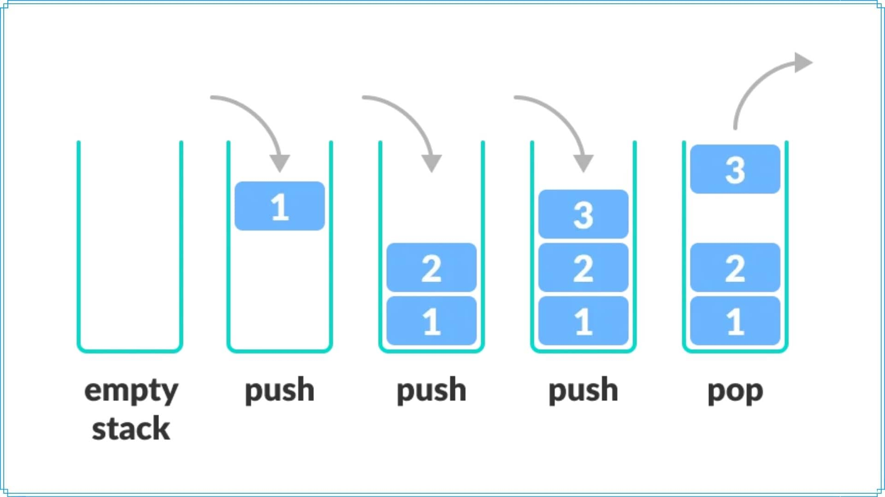

# **STACK**




<div style="margin-right: 330px;">

**Stack** - is a data structure consisting of an ordered set of elements in which new elements are added and existing ones are deleted from one end, called the top of the stack. Moreover, the element that was placed there last is removed first from the stack, that is, the "last in, first out" (**last—in, first-out - LIFO**) strategy is implemented in the stack.

The library implements its own stack and all standard methods. In addition, there are several additional methods, such as *StackCheak*, *StackClean* and *StackFind*.

## Installation and compilation
To run the program on your computer, download the repository and run the Makefile
1. Cloning a repository
```bash
https://github.com/Yan103/Stack
```
2. Compilation of source files
```bash
make
```
3. Start
```bash
make run
```
4. Optional: remove files (deleting object and executable files)
```bash
make clean
```
For a more detailed study of the principle of operation of the program, you can also read the *documentation* that is available in.

## Principle of work
The library implements the standard functions StackPop and StackPush, StackCtor, StackDtor, as well as several additional functions (read the documentation). Debug mode also stores debug information (you can also read about it in the documentation).

The example of using stack methods:


The example of stack information output (STACK_DUMP):


The example of output, when receiving errors:


## Contact information
If you are interested in this project or have any questions/suggestions about the project, you can contact the author:

**Mail**: fazleev.yans@phystech.edu

**Telegram**: @yan_ya_n3


